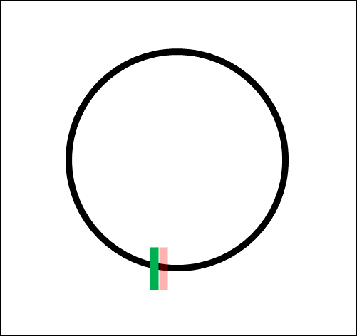
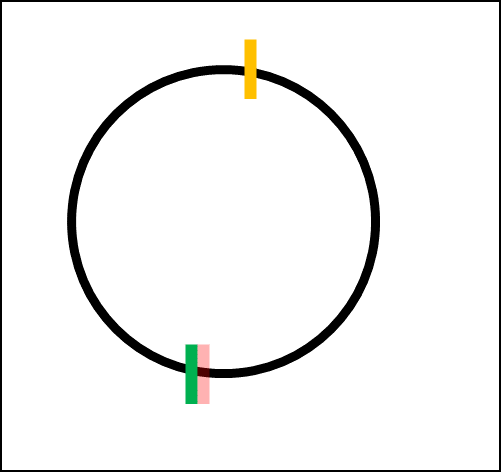
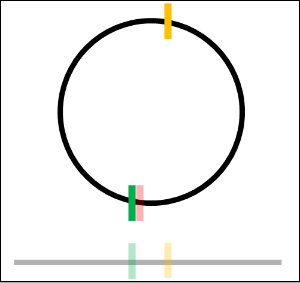
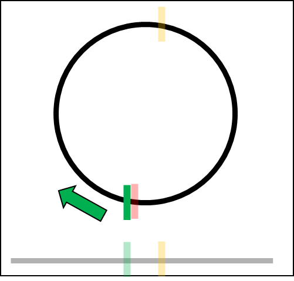
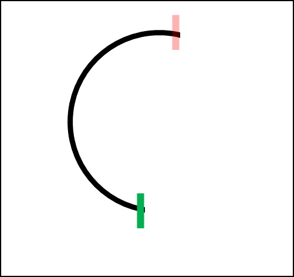
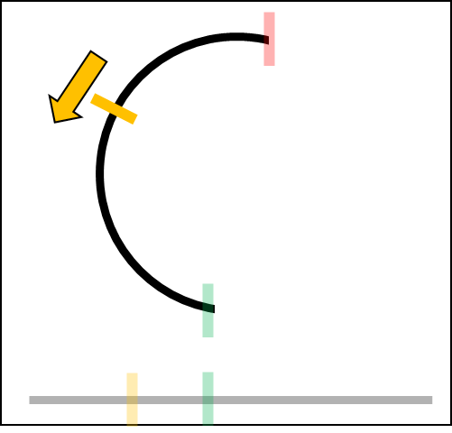
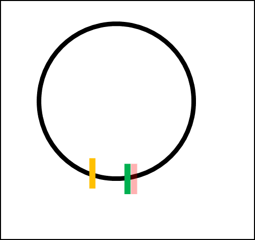
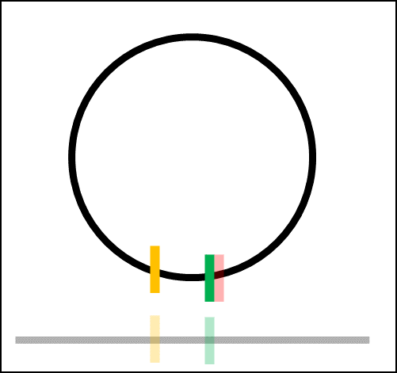
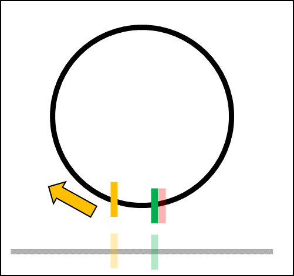
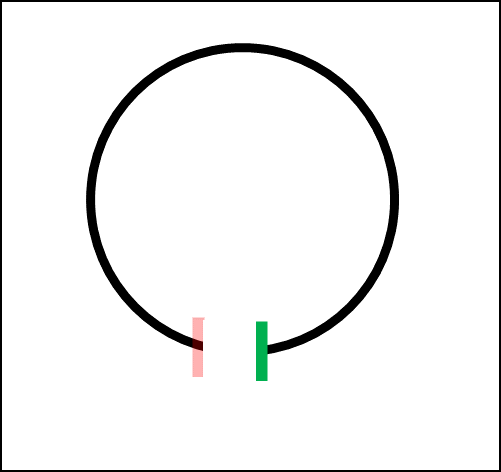

+++
title = "Projecting Shapes"
date = 2022-12-11T17:14:18+01:00
weight = 4
chapter = false
pre = "<b>4. </b>"
+++

## Projecting a point

The dot product can be used to project a point on an axis.

{}
```python
def ProjectPointOnAxis(point, axis) -> float:
  return DotProduct(point, axis);
```
{}


### 2D Dot Product


{}
```python
def DotProduct(v1, v2) -> float:
  return v1.x * v2.x + v1.y * v2.y
```
{}


### 3D Dot Product


{}
```python
def DotProduct(v1, v2) -> float:
  return v1.x * v2.x + v1.y * v2.y + v1.z * v2.z
```
{}


### Dot Product Generalization


{}
```python
def DotProduct(v1, v2) -> float:
  nbDimensions = v1.GetDimension()
  total = 0
  for i in range(nbDimensions):
    total += v1.coords[i] * v2.coords[i]
  return total
```
{}


## Projecting a circle, sphere, or hypersphere 

To simulate an hypersphere, we usually make models with a lot of triangles and vertices.\
This is one of the best ways we know to render hyperspheres with other objects.\
However, for collisions, we do not need this representation, since it only makes the performance worse.\
Instead, we can just use the mathematical properties of the hypersphere and have O(1) performance.


{}
```python
def ProjectSphereOnAxis(hyperSphere: HyperSphere, axis: Vector) -> Range:
    centerProj = ProjectPointOnAxis(hyperSphere.center, axis.normalized())

    range = new Range()
    range.min = centerProj - hyperSphere.radius
    range.max = centerProj + hyperSphere.radius

    return range
```
{}


## Projecting a polygon 

Mostly used shapes are models composed of vertices.\
The projection of all the points of an edge is equal to the range of the projection of its two vertices.


{}
```python
def ProjectShapeOnAxis(shape: Shape, axis: Vector) -> Range:
    range = new Range()    
    range.min = Math.max()
    range.max = Math.min()

    for vertex in shape.vertices:
        proj = ProjectPointOnAxis(vertex, axis)
        if (proj < range.min):
            range.min = proj
        if (proj > range.max):
            range.max = proj

    return range
```
{}


## Projecting a 2D convex polygon 

### The extremum properties 

#### Definitions 

Let S(t) be the parametric equation of a convex shape.\ 
It returns a point of the shape for a given t.

Let P(t) = DotProduct(S(t), axis).\
P(t) is the projection of the points of that shape on a given axis.

Example : \
S(t) = r * cos(t) * i + r * sin(t) * j \
S(t) represents a circle with a radius of r, centered around the origin.
 

#### Properties of S(t) 


{}
S(t) represents a closed set, so S(t) is continuous.
{}
{}
S(t) represents a closed set, so S(t) is periodic.

i.e. : if we choose a point and follow the line, we end up looping and coming back to that first point.
{}


#### Properties of P(t) 


{}
P(t) = DotProduct(S(t), axis).

S(t) is continuous. DotProduct is a continuous map.

So P(t) is continuous.
{}
{}
P(t) = DotProduct(S(t), axis).

S(t) is periodic, and axis is constant.

So P(t) is periodic too, with the same period as S(t). 
{}

{}
Every local maximum of P(t) is equal to the maximum of P(t).
{}

{}
Every local minimum of P(t) is equal to the minimum of P(t).
{}



### Dichotomy 

As we saw before, once we find the extremum, we do not have to test the other vertices anymore.

The projections are also continuous, and there are only 2 extremums, so:


{}
```python
# Algorithm created by myself, and proud of it, hehe

def NextIndex(shape, index):
  size = len(shape.vertices)
  return (index + 1) % size

def PrevIndex(shape, index):
  size = len(shape.vertices)
  return (index - 1 + size) % size

def GetMiddleIndex(shape, id1, id2):
  if (id1 < id2):
    return (id1 + id2) / 2
  else:
    size = len(shape.vertices)
    dist = size - (id1 - id2)
    return (id1 + dist / 2) % size

def IsSmallerClockwise(shape, axis, index):
  p = ProjectPointOnAxis(shape.vertices[index], axis)
  pNext = ProjectPointOnAxis(shape.vertices[NextIndex(shape, index)], axis)
  return pNext < p

def IsSmallerAntiClockwise(shape, axis, index):
  p = ProjectPointOnAxis(shape.vertices[index], axis)
  pPrev = ProjectPointOnAxis(shape.vertices[PrevIndex(shape, index)], axis)
  return pPrev < p

# This function is tail recursive, so the compiler can optimize it out
def SearchMinProjectionOnAxis(shape: Shape, axis: Vector, minIndex, maxIndex) -> float:
    interval = maxIndex - minIndex

    i1 = minIndex
    i2 = GetMiddleIndex(shape, minIndex, maxIndex) # half
  
    v1 = shape.vertices[i1]
    v2 = shape.vertices[i2]
    
    p1 = ProjectPointOnAxis(v1, axis)
    p2 = ProjectPointOnAxis(v2, axis)

    if (p1 < p2):
      # Go in the direction of p1
      if (IsSmallerClockwise(shape, axis, i1)):
        return SearchMinProjectionOnAxis(shape, axis, i1, i2) # clockwise
      if (IsSmallerAntiClockwise(shape, axis, i1)):
        return SearchMinProjectionOnAxis(shape, axis, i2, i1) # anti clockwise
      # else, already at the end
      return p1
      
    elif (p2 < p1):
      # Go in the direction of p2
      if (IsSmallerClockwise(shape, axis, i2)):
        return SearchMinProjectionOnAxis(shape, axis, i2, i1) # clockwise
      if (IsSmallerAntiClockwise(shape, axis, i2, i1)): 
        return SearchMinProjectionOnAxis(shape, axis, i1, i2) # anti clockwise
      # else, already at the end
      return p2 

# The same algorithm can be used to find the maximum projection.
# Cases where projections are equal are not checked, but have to be and can be.
# This program is not optimized, but has for goal to describe how the algorithm works.

def ProjectShapeOnAxis(shape: Shape, axis: Vector) -> Range:
    range = new Range()    
    range.min = SearchMinProjectionOnAxis(shape, axis, 0, len(shape.vertices))
    range.max = SearchMaxProjectionOnAxis(shape, axis, 0, len(shape.vertices))
    return range
```
{}


<table>
    <tr>
      <th>Case</th>
      <th>Complexity</th>
    </tr>
    <tr>
      <td>Worst case</td>
      <td>O(log(N))</td>
    </tr>
    <tr>
      <td>Average case</td>
      <td>O(log(N))</td>
    </tr>
    <tr>
      <td>Best case</td>
      <td>O(1)</td>
    </tr>
  </table>

{}
This algorithm is very optimized for a high number of vertices.
However, in practice, there are only a few games that have that many vertices in 2D. 
Due to the different checks, this algorithm is sure to be less optimized for a few amount of vertices.
{}

### Examples : 


{}

{}
{}

{}    
{}

{}     
{}

{}    
{}

{}     
{}

{}     



{}

{}
{}

{}      
{}

{}     
{}

{}      



### Projecting an arbitrary 2D shape 

#### The brute force way 

An arbitrary shape can be constructed with the function S(t), described above. \
The brute force way of projecting the shape is just to project every point returned by that function. \
Of course, it is impossible to project every point. \
That is why we set a precision.

{}
This method does not return the exact projection of the shape, but it is the best we can do without any more precisions on the shape.
The performance is also horrible for what it is.
{}


{}
```python
# shape.s(t) returns the vertices of shape
# shape.s(t) is periodic with a period of 1
def ProjectShapeOnAxis(shape: Shape, axis: Vector, precision: int) -> Range:
    range = new Range()    
    range.min = Math.max()
    range.max = Math.min()

    step = 1 / precision
    for i in  range(precision))
        proj = ProjectPointOnAxis(shape.s(i*step), axis)
        if (proj < range.min):
            range.min = proj
        if (proj > range.max):
            range.max = proj

    return range
```
{}


#### The smarter way 

Being a convex shape, the same algorithm applied in the Dichotomy section can be used.\
vertices[i] will be replaced by S(t).\
Instead of adding 1 to the index, we will add a very small value to t.\
Same for removing it.\
We could also compute the derivative of P(t) to determine the direction, if possible.\
Also, a maximum depth will be used instead of a precision to prevent infinite recursion.

{}
This method does not return the exact projection of the shape either. 
However, the precision can be very accurate because of the depth we can easily increase thanks to the O(log(n)) complexity of the algorithm.
{}


