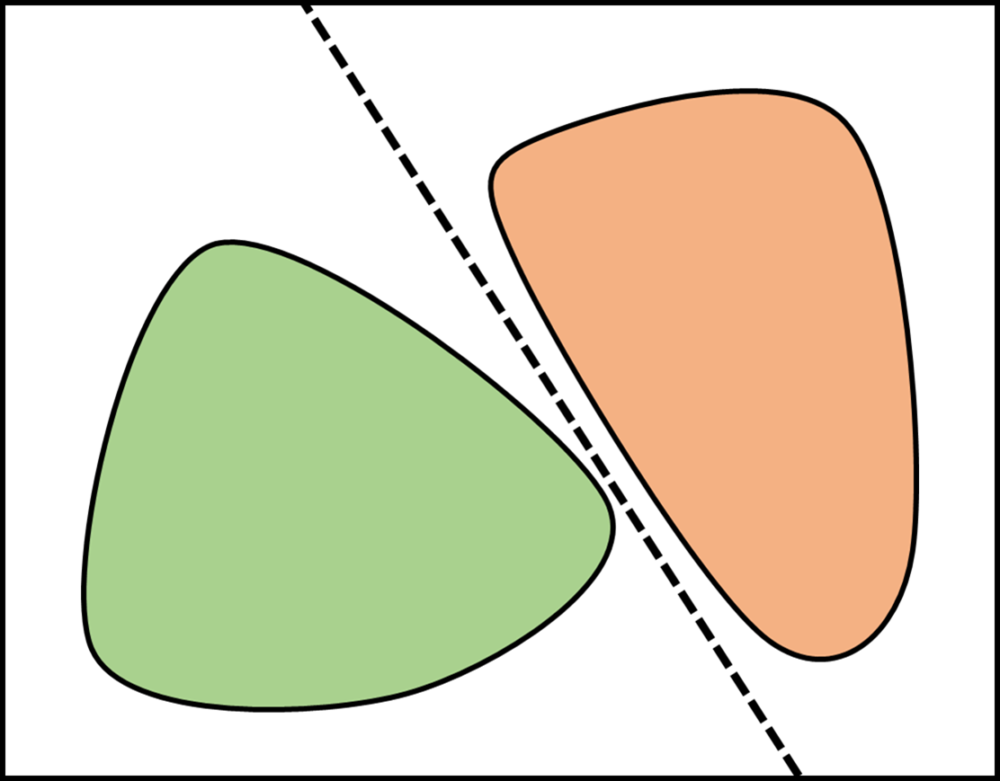
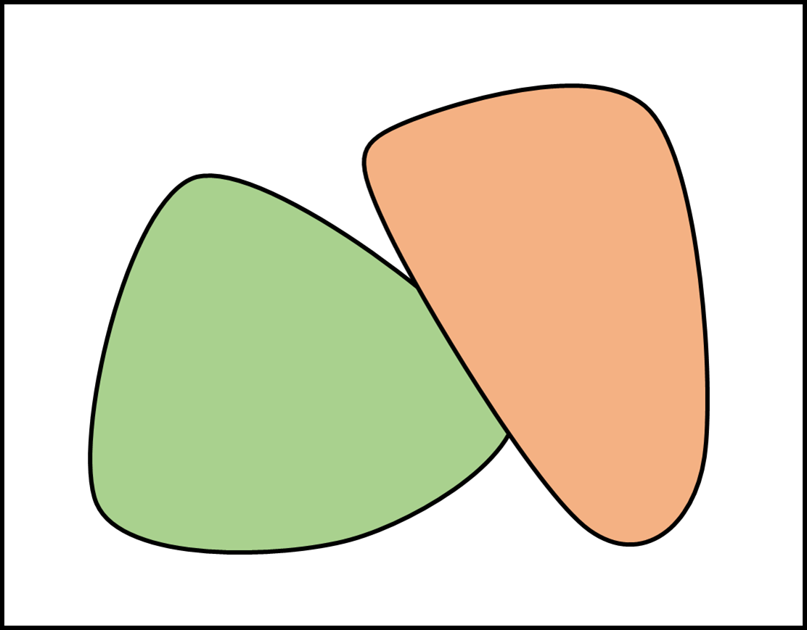
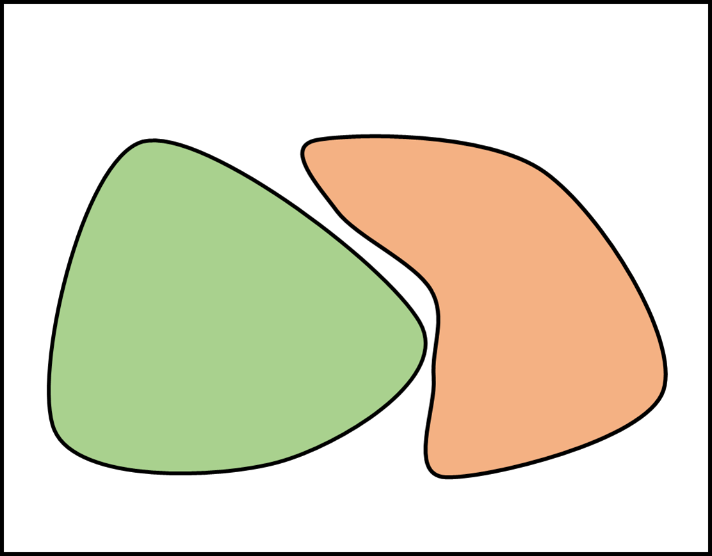
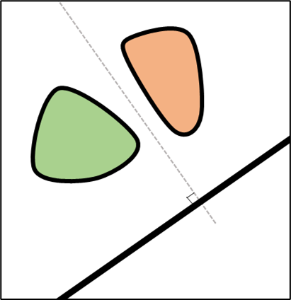
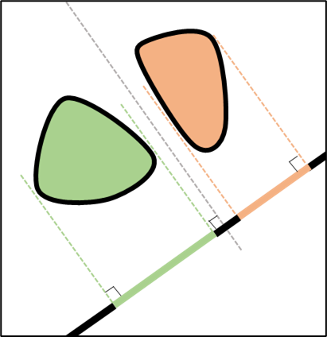
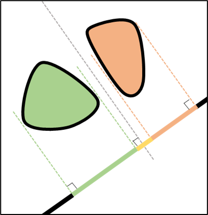
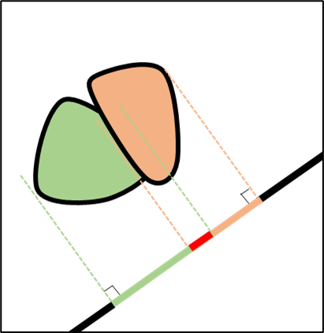
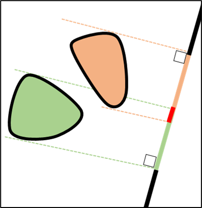

+++
title = "Theory"
date = 2022-12-11T17:14:18+01:00
weight = 1
chapter = false
pre = "<b>1. </b>"
+++

## Hyperplane Separation Theorem 

### For 2D 
**Theorem:**
If two convex shapes do not collide, then, a straight line can separate them.

**Contrapositive:**
If two convex shapes collide, then, there is no straight line separating them.

### For 3D 
**Theorem:**
If two convex shapes do not collide, then, a plane can separate them.

**Contrapositive:**
If two convex shapes collide, then, there is no plane separating them.

### Generalization for higher dimensions 
**Theorem:**
If two convex shapes do not collide, then, a hyperplane can separate them.

**Contrapositive:**
If two convex shapes collide, then, there is no hyperplane separating them.

### Examples : 


{}

{}
{}

{}    
{}

{}     


## Separating Axis Theorem 
### Definition : 
**Statement:** The line, plane, or hyperplane described above always has a normal axis. 

**Theorem:** If the shapes are not colliding, the projections of the shapes on this axis do not overlap.

**Contrapositive:** If the shapes are colliding, then, no matter the axis we take, the projections of the shapes on this axis will overlap 
{}
Whether there are collisions or not, there will always exist an axis for which the projections of the shapes overlap.  
{}

### Examples : 


{}

{}
{}

{}    
{}

{}     
{}

{}    
{}

{}     
